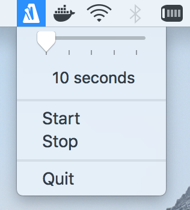
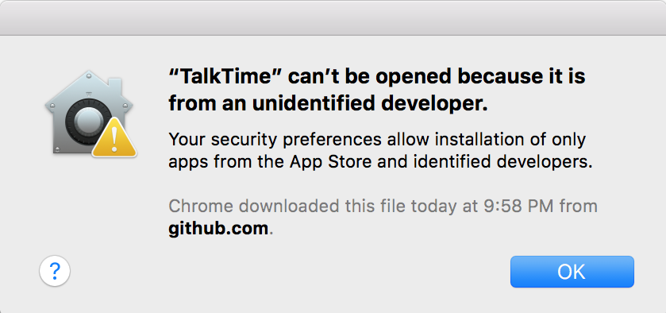
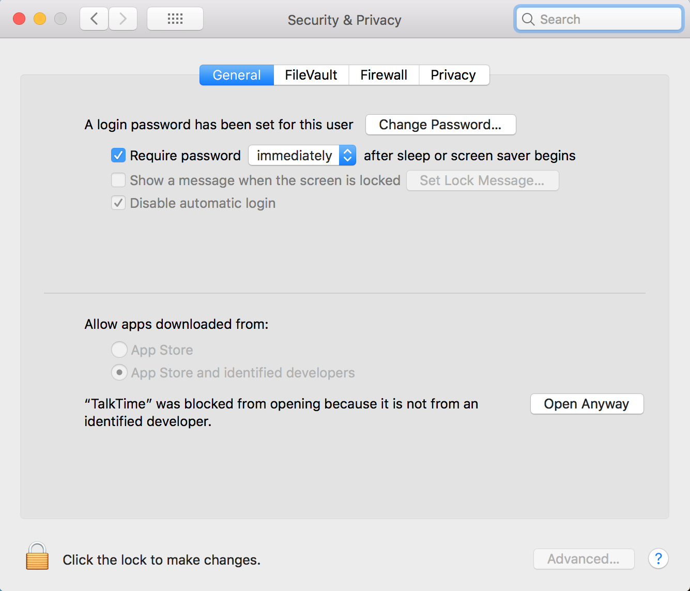

# TalkTime

This is a small status bar app for macOS intended to be like a metronome for study. Using the system speech synthesizer it will announce the total elapsed time every time the specified interval elapses.

## Usage

Select the interval you would like between announcements, then click Start.

## Installation

Download [this zip file](https://github.com/liambuchanan/TalkTime/releases/download/1.0/TalkTime.app.zip), unzip it, and move the app to your Applications folder.

You may receive a scaryish warning that looks something like this.

In that case you'll need to navigate to System Preferences > Security & Privacy and you should see something that looks like this. Click Open Anyway.

